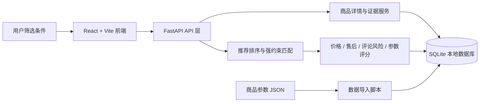

# CampRank

CampRank 是一个户外帐篷购买风险辅助决策系统。用户输入预算、使用场景和购买侧重点后，系统会结合商品参数、价格、售后文本和评论风险，生成 3 个购买方案：首选方案、低价备选和谨慎选择。

> 当前推荐只作为购买风险参考，不等同于专业户外性能测评。

## 项目架构



## 核心模块

- `frontend/`：用户筛选入口、推荐结果页、商品证据页、低价对比页
- `backend/app/api/`：推荐、商品详情、价格对比、评论风险等接口
- `backend/app/scoring/`：价格、售后、评论风险、商品参数和推荐排序逻辑
- `backend/app/services/`：商品详情、评分计算、参数分析和评论分析服务
- `backend/data/`：可提交的参数样例和官方响应样例，不包含本地评论数据
- `scripts/`：项目级检查、数据导入和参数导入脚本

## 推荐流程

1. 前端收集预算、使用场景和购买侧重点。
2. 后端先按预算过滤候选商品。
3. 推荐排序模块判断场景和多选偏好是否满足。
4. 系统按 `core_match / partial_match / fallback` 分层排序。
5. 前端展示 3 个购买方案，并标出满足项和未满足项。

## 主要功能

- 按预算、场景和偏好筛选帐篷候选商品
- 输出“首选方案 / 低价备选 / 谨慎选择”三类建议
- 标注“完全满足 / 部分满足 / 补位参考”
- 展示价格、评论风险、售后和商品参数依据
- 对缺失参数显示“待确认”，不补造重量、防水、防风、收纳等信息

## 技术栈

- 后端：FastAPI + SQLAlchemy + SQLite
- 前端：React + Vite
- 测试：pytest + Vite build

## 本地启动

### 1. 启动后端

```bash
cd backend
pip install -r requirements.txt
python scripts/init_db.py
python scripts/seed_sample_data.py
python -m uvicorn app.main:app --host 127.0.0.1 --port 8000
```

### 2. 启动前端

```bash
cd frontend
npm install
npm run dev
```

打开：

```text
http://127.0.0.1:5173/
```

## 常用命令

运行全量检查：

```bash
python scripts/check_all.py
```

单独运行后端测试：

```bash
cd backend
python -m pytest
```

单独构建前端：

```bash
cd frontend
npm run build
```

## 数据边界

- 本仓库不提交本地数据库、评论样本、导入报告、日志、构建产物和依赖目录
- 商品参数仅来自真实页面参数或用户提供的整理文件
- 缺失字段会在页面中提示“待确认”，不会为了展示效果补造
- 当前推荐依据以京东商品价格、售后文本、评论风险和页面标称参数为主

## 目录结构

```text
backend/   FastAPI 后端、数据模型、评分和推荐逻辑
frontend/  React 前端页面和组件
scripts/   项目级检查和数据处理脚本
docs/      数据流程、字段约定和项目文档
```
