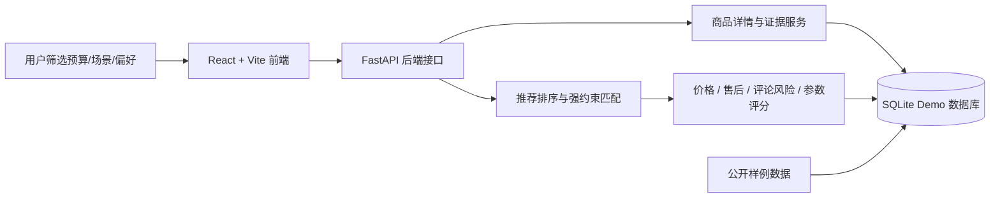

# CampRank

CampRank 是一个户外帐篷购买决策 Demo。用户选择预算、使用场景和购买侧重点后，系统会结合商品参数、价格、售后文本和评论风险，给出 3 个购买方案：首选方案、低价备选和谨慎选择。

> 当前结果用于购买风险参考，不等同于专业户外性能测评。缺失参数会标注为待确认，不会为了展示效果补造数据。

## 架构



## 主要功能

- 按预算、露营场景和购买偏好筛选帐篷。
- 推荐结果区分 `完全满足`、`部分满足`、`补位参考`。
- 展示价格、售后、商品参数、评论风险和推荐依据。
- 不把缺失的重量、防水、防风、收纳等参数当作已满足。
- 支持公开 Demo 部署：前端 Vercel，后端 Render。

## 目录

```text
backend/   FastAPI API、数据模型、评分和推荐逻辑
frontend/  React + Vite 用户界面
scripts/   项目检查和数据处理脚本
docs/      数据流程、部署和项目说明
```

## 本地启动

启动后端：

```bash
cd backend
pip install -r requirements.txt
python scripts/init_db.py
python scripts/seed_sample_data.py
python -m uvicorn app.main:app --host 127.0.0.1 --port 8000
```

启动前端：

```bash
cd frontend
npm install
npm run dev
```

打开：

```text
http://127.0.0.1:5173/
```

## 公开 Demo 部署

推荐部署方式：

- 后端：Render Web Service，Root Directory 设置为 `backend`。
- 前端：Vercel Project，Root Directory 设置为 `frontend`。
- 前端环境变量：

```text
VITE_API_BASE_URL=https://你的-render-后端地址
```

详细步骤见 [docs/deployment_demo.md](docs/deployment_demo.md)。

## 常用检查

全量检查：

```bash
python scripts/check_all.py
```

后端测试：

```bash
cd backend
python -m pytest
```

前端构建：

```bash
cd frontend
npm run build
```

## 数据边界

不会提交这些本地数据：

- `backend/data/real_samples/`
- `backend/data/import_reports/`
- `backend/camp_rank.db`
- `*.db`、`*.sqlite`、日志、构建产物、依赖目录

公开 Demo 只使用样例数据初始化。真实评论数据、本地数据库和导入报告不要推送到 GitHub。
