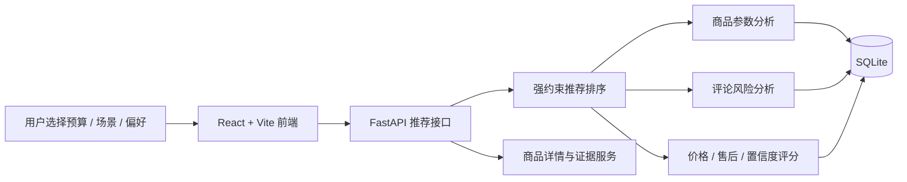

# CampRank

**京东帐篷 AI 购买决策系统**

CampRank 是一个面向大学生和初入职场用户的 AI 应用项目，聚焦 `100-1000 元`预算内的京东帐篷选购场景。系统基于商品参数、价格、售后信息和评论风险分析，输出 `首选方案`、`低价备选`、`谨慎选择` 三类可解释购买建议。

这个项目的重点不是做商品列表，而是把真实电商数据转化为可计算、可解释的购买决策依据。

## 项目亮点

- **商品证据建模**：将京东非标准商品参数解析为重量、尺寸、防水、容量、搭建方式等结构化指标。
- **评论风险量化**：对评论进行质量加权和风险识别，沉淀漏水、防风差、异味、难搭、售后等风险维度。
- **样本偏差校准**：通过正评/中评/差评分层权重、先验风险和贝叶斯平滑，降低评论分布偏斜带来的误判。
- **强约束推荐排序**：先按预算和核心需求过滤，再按匹配层级排序，避免只靠综合分推荐。
- **可解释输出**：推荐结果展示已满足项、未满足项、风险提示和排序依据。

## 适用场景

目标用户是预算有限、缺少户外装备经验的年轻消费者，例如：

- 大学生周末露营、公园速开、社团活动。
- 初入职场用户短途出游、轻露营、多人聚会。
- 想在京东低预算帐篷里快速判断“哪款值得买、哪款要谨慎”的用户。

## 系统架构



## 核心链路

```text
京东商品参数 / 价格 / 售后 / 评论
        ↓
数据清洗与入库
        ↓
商品参数结构化
        ↓
评论质量加权与风险识别
        ↓
样本偏差校准与证据置信度计算
        ↓
预算过滤 + 场景约束 + 偏好校验
        ↓
首选方案 / 低价备选 / 谨慎选择
```

## 技术栈

**Frontend**

- React
- Vite
- JavaScript
- CSS

**Backend**

- Python
- FastAPI
- SQLAlchemy
- SQLite
- Pytest

**AI / Data**

- 评论文本分析
- 评论质量加权
- 风险维度识别
- 贝叶斯平滑
- 推荐排序
- 数据清洗与指标建模

## 目录结构

```text
backend/
  app/
    api/          FastAPI 接口
    models/       数据模型
    nlp/          评论分析与风险识别
    scoring/      评分、风险校准、推荐排序
    services/     商品、评论、评分服务
    ingestion/    数据导入与清洗
  scripts/        数据库初始化与数据处理脚本
  tests/          后端测试

frontend/
  src/
    pages/        首页、推荐页、详情页、价格对比页
    components/   推荐卡片、风险面板、评分组件
    api/          API 请求封装
    utils/        格式化与链接处理

docs/             项目设计、部署、数据流程说明
scripts/          项目级检查脚本
```

## 本地启动

启动后端：

```bash
cd backend
pip install -r requirements.txt
python scripts/init_db.py
python scripts/seed_sample_data.py
python -m uvicorn app.main:app --host 127.0.0.1 --port 8000
```

启动前端：

```bash
cd frontend
npm install
npm run dev
```

打开：

```text
http://127.0.0.1:5173/
```

## 常用检查

```bash
python scripts/check_all.py
```

后端测试：

```bash
cd backend
python -m pytest
```

前端构建：

```bash
cd frontend
npm run build
```

## 数据边界

本仓库用于展示项目代码和架构，不包含本地真实评论数据。

不会提交：

- `backend/camp_rank.db`
- `backend/data/real_samples/`
- `backend/data/import_reports/`
- `backend/data/product_parameters*.json`
- `*.xlsx`
- `*.docx`
- 日志、构建产物、依赖目录

公开仓库只保留代码、测试、文档和必要的公开样例文件。真实京东评论数据和本地数据库仅用于本地验证。

## 项目定位

CampRank 体现的是一个 AI 应用项目的完整链路：从真实业务问题出发，完成数据清洗、指标建模、评论风险分析、推荐排序、前后端展示和数据边界控制。
